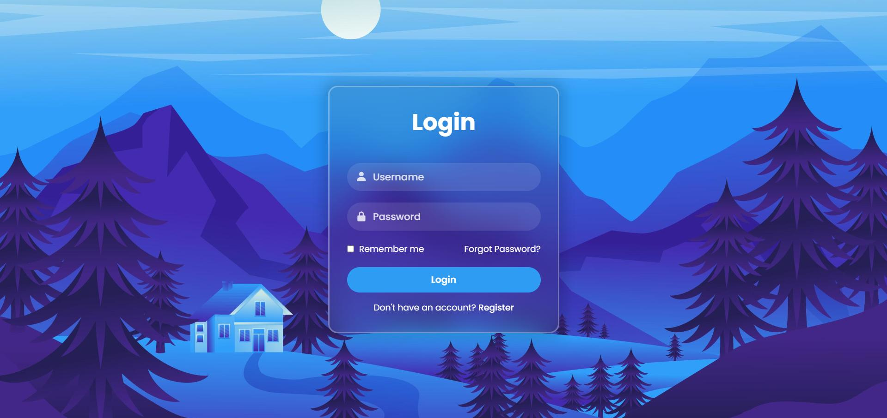

# Login Form 5

A beautiful, responsive login form built with pure HTML and CSS.



Overview

This repository contains a simple, elegant login form design you can use as a starting point for your projects. It's intentionally lightweight and easy to customize.

Files

- `index.html` — the markup for the login form
- `style.css` — styles and layout
- `bg.jpg` — background image used by the design
- `1712946044384.jpg` — screenshot / preview image

Quick start

1. Clone the repository:

   ```bash
   git clone https://github.com/BinaryVortex/Login-Form-5.git
   cd Login-Form-5
   ```

2. Open `index.html` in your browser (double-click or use `http-server` / live server).

3. Customize `style.css` to change colors, spacing, or fonts.

Features

- Modern, minimal design
- Responsive layout for smaller screens
- Simple HTML structure for easy integration

Customization tips

- Change the background: replace `bg.jpg` or update the `background-image` in `style.css`.
- Adjust colors: edit the CSS color rules in `style.css`.
- Add validation or JavaScript behavior by including a script tag in `index.html`.

Contributing

Contributions, suggestions and improvements are welcome — feel free to open an issue or submit a pull request.

License

MIT © BinaryVortex
